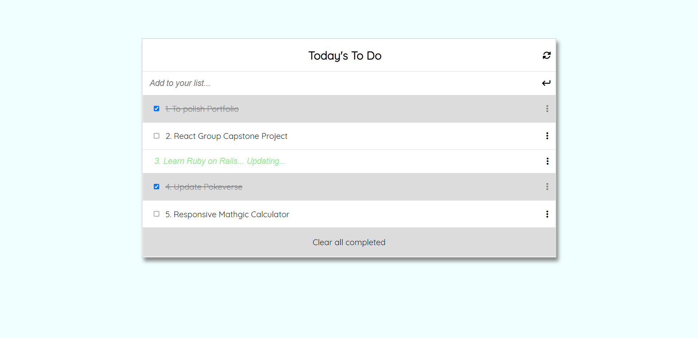

# To Do List

> To Do List provides you with functionalities such as:
> - adding a Todo to the list
> - removing a Todo from the list
> - editing a Todo in the list
> - checking whether completed or not a Todo in the list

## Built With
- HTML
- CSS
- JS

## Screenshot

## Getting Started

To get a local copy up and running:

1. Clone this repository or download the zip folder:

**``git clone https://github.com/rex-9/ToDoList.git``**

2. Navigate to the location of the folder in your machine:

**``you@your-Pc-name:~$ cd <folder>``**

To get a local copy up and running follow these simple example steps.

### Deployment

Here is the online version of [To Do List](https://rex-9.github.io/ToDoList/)

## Author
👤 - Github: [rex-9](https://github.com/rex-9/) 
👤 - LinkedIn: [rex9](https://www.linkedin.com/in/rex9/) 
👤 - Angelist: [rex9](https://angel.co/u/rex9) 
👤 - Facebook: [Htet Naing](https://www.facebook.com/htetnaing0814)

Contributions, issues, and feature requests are welcome!

Feel free to check [issue page](https://github.com/rex-9/ToDoList/issues).

## Show your support
Give a ⭐️ if you like this project!

## Acknowledgments
[Microverse](https://bit.ly/MicroverseTN)
